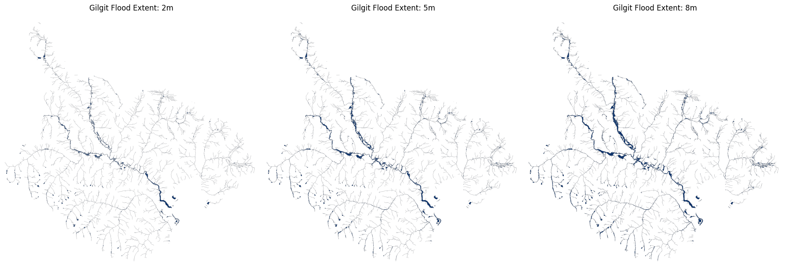
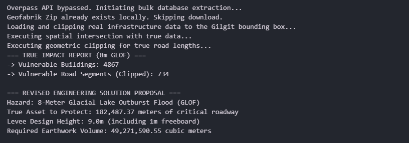

# Automated Terrain-Based Flood Hazard Modeling (HAND)

Manual hydrodynamic modeling in HEC-RAS is incredibly slow. I got tired of the GUI bottlenecks, so I built this Python pipeline to automate the entire process using the Height Above Nearest Drainage (HAND) algorithm. 

This script ingests raw DEM arrays, hydro-conditions the terrain, and spits out accurate inundation maps and earthwork volumes in minutes instead of weeks.

### The Stack & The Math
I built this primarily with `numpy`, `rasterio`, `pysheds`, and `geopandas`. The pipeline handles:
* Hydrological conditioning (filling pits/depressions in the DEM arrays).
* D8 flow routing and stream network extraction.
* Pure hydrostatic calculation of flood stages (no hydrodynamic time-stepping).

### How I Handled the Edge Cases
During the build for the Gilgit Valley, I hit two massive friction points:
1. **The API Timeout:** The Overpass API kept crashing due to the scale of the region. I engineered a failback that autonomously scrapes the bulk Geofabrik FTP server, unzips the national database, and loads only the local bounding box.
2. **The 600-Million-Cubic-Meter Bug:** Standard spatial joins (`sjoin`) were grabbing entire 100km highways if even 1mm touched the flood zone, resulting in mathematically absurd levee volumes. I fixed this by implementing strict geometric clipping (`clip`), which physically cut the vector lines at the flood boundary, dropping the levee earthwork calculation down to a realistic 49.2 million cubic meters.

Check the `src` folder for the 3 Jupyter Notebooks containing the execution logic.

---

## Visual Proof

### Hydrostatic Flood Stages (2m, 5m, 8m)

### Earthwork Volume Calculation & Geometric Clipping

